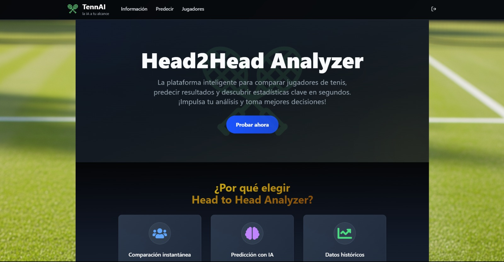
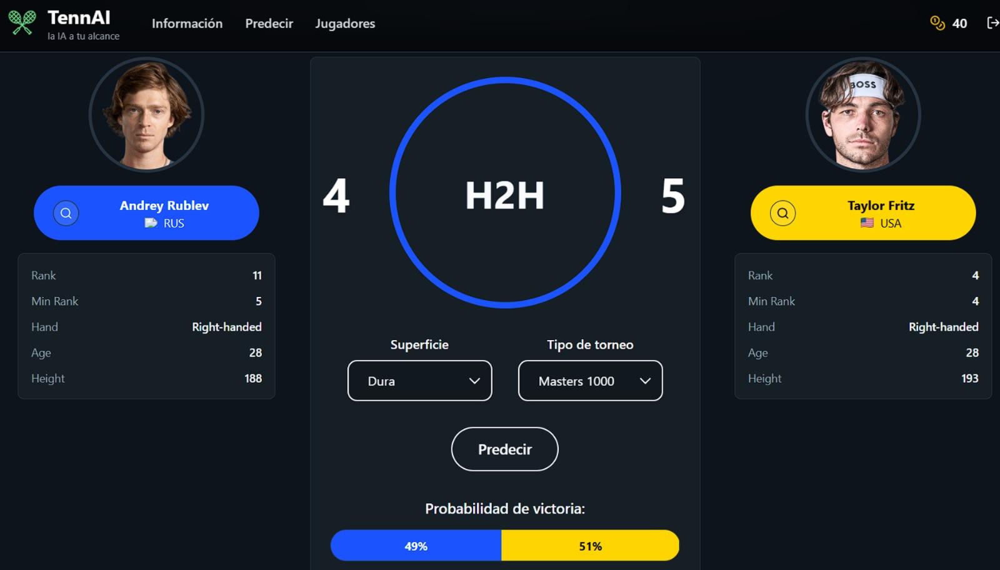
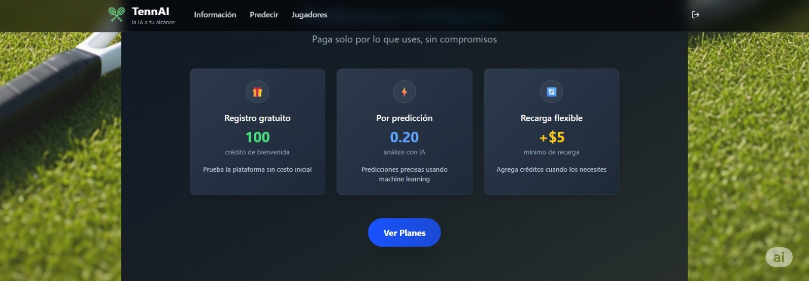
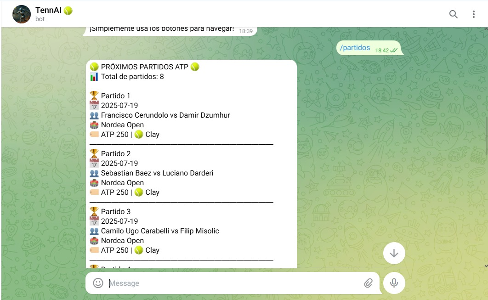
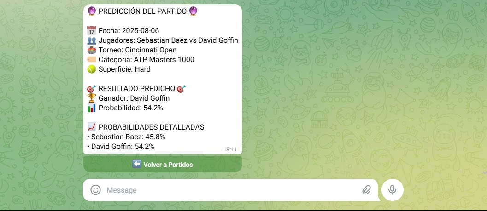

# 🎾 TennAI - Head2Head Analyzer

> **TennAI** es una plataforma de análisis y predicción de partidos del circuito ATP que utiliza inteligencia artificial (XGBoost) para generar predicciones precisas basadas en estadísticas históricas, head-to-head, superficie de juego, tipo de torneo, etc.

## 🚀 Características Principales

- 🧠 **Predicciones con IA**: Modelo XGBoost entrenado con datos históricos del ATP
- 📊 **Análisis Head-to-Head**: Comparación directa entre jugadores

- 🎯 **Predicciones Contextuales**: Considera superficie, tipo de torneo y condiciones
- 👤 **Perfiles de Jugadores**: Estadísticas detalladas y rendimiento histórico
- 💳 **Sistema de Créditos**: Gestión de predicciones con planes de suscripción

- 🔐 **Autenticación Firebase**: Registro y login seguro
- 📱 **Bot de Telegram**: Acceso a predicciones desde Telegram

- 🌐 **Responsive Design**: Optimizado para móviles y desktop

## 🏗️ Arquitectura del Sistema

### APIs Backend

**🗄️ API Base de Datos**
- Gestión de usuarios y autenticación
- Estadísticas y perfiles de jugadores ATP
- Sistema de créditos y suscripciones

**🧠 API Modelo**
- Predicciones con XGBoost
- Análisis head-to-head
- Cálculo de probabilidades

**🤖 Bot Telegram**
- Interfaz conversacional
- Predicciones por chat

### 🛠️ Stack Tecnológico

**Frontend:**
- React 18 + TypeScript
- Vite (build tool)
- Tailwind CSS + Shadcn/ui
- Firebase Authentication

**Backend APIs:**
- FastAPI (Python)
- XGBoost (modelo de ML)
- SQLAlchemy + PostgreSQL
- Firebase Admin SDK

> [!NOTE]
> La infraestructura backend está preparada para el despliegue en Google Cloud Platform (GCP) utilizando Cloud Run.

**Bot:**
- Python Telegram Bot
- Docker containerizado

> [!IMPORTANT]
> EL proyecto se encuentra deprecado debido a la falta de información actualizada y la dificultad para mantener el modelo de IA con datos recientes. 
